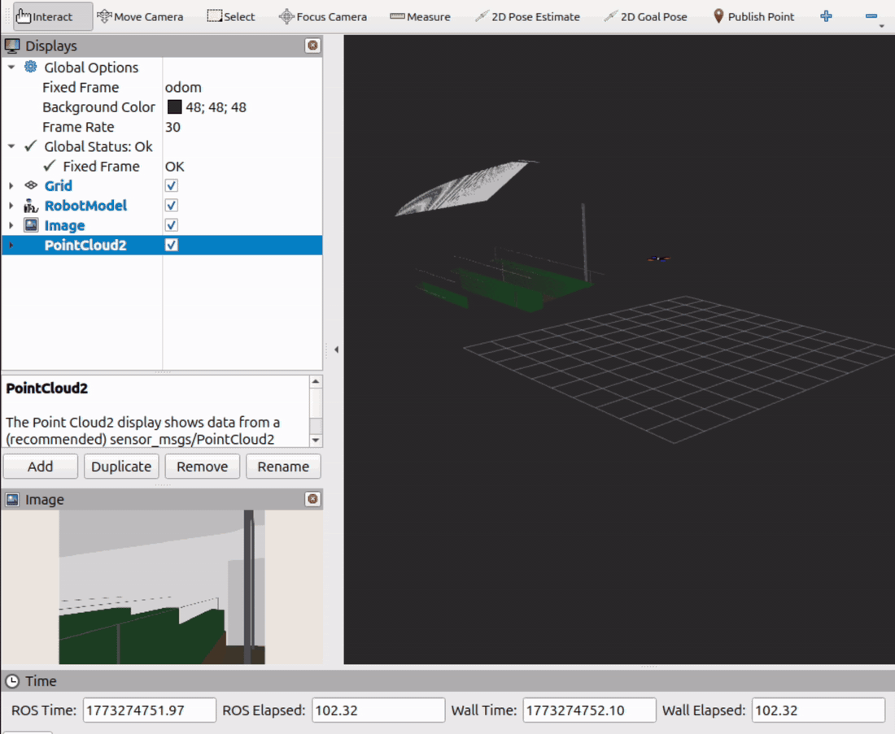
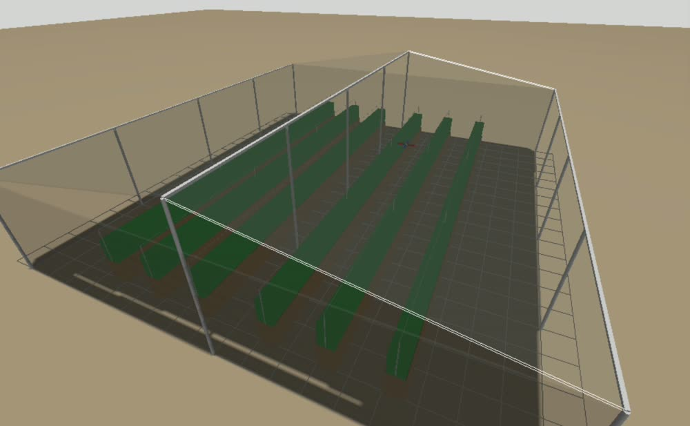
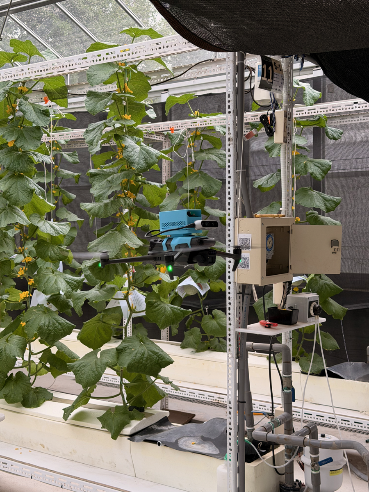

### UAV-Based Mobile Sensing for GPS-denied Greenhouse CO₂ Mapping

Z2 is a self-contained sensing payload that turns a single drone flight into a
3D map of greenhouse CO₂ concentration without relying on GPS or the
drone's onboard navigation system.

Z2 mounted to a DJI Mavic 3M

---

## Project overview

Greenhouse crops consume CO₂ unevenly. Ventilation, injection points, plant density, and
temperature all create local variations, but most growers measure the space with only a
handful of fixed sensors. Installing enough sensors to capture the full distribution is
expensive to wire, calibrate, and maintain.

Atmosense replaces that dense sensor network with one mobile sensor and a probabilistic
model. The payload:

- Localizes itself indoors using stereo visual-inertial SLAM
- Synchronizes CO₂, environmental, and pose data in ROS 2
- Streams live telemetry to a ground-station dashboard
- Records every sensor stream for offline reprocessing
- Reconstructs a continuous 3D CO₂ field with an uncertainty estimate at every point

| | |
|:--|:--|
| **Timeline** | January–August 2026 |
| **Team** | Five-person SFU Mechatronic Systems Engineering capstone team |
| **My role** | Hardware and Software Lead |
| **Field trials** | 🇹🇼 National Taiwan University and 🇰🇷 Seoul National University |
| **Recognition** | 🏆 Best Capstone Project, SFU MSE Demo Day |

---

## Live system demo

The Raspberry Pi streams telemetry over local Wi-Fi to a Foxglove ground station. The
dashboard combines the payload's 3D trajectory, georeferenced CO₂ samples, tracked camera
feed, and live sensor plots in one view. Mission controls are sent back over the same link.

### From flight path to 3D concentration field

The model estimates both CO₂ concentration and its uncertainty throughout the greenhouse volume. Confidence is highest near measured flight paths and decreases in unvisited regions or during long gaps between flights.

<table>
<tr>
<td width="50%" align="center">

 <b>Concentration estimate</b> μ(x, τ)
</td>
<td width="50%" align="center">

 <b>Model uncertainty</b> σ(x, τ)
</td>
</tr>
</table>

Time-lapse of a full day at the NTU research greenhouse. Between flights, the model forecasts how the field evolves over time.

---

## How it works

### 1. Onboard sensing and telemetry

Everything runs on a Raspberry Pi 5 with Ubuntu 24.04 and ROS 2 Jazzy. Sensor data is
recorded locally in MCAP format while Foxglove Bridge streams a live view over Wi-Fi. If
the connection drops, the flight data remains safely stored onboard.

The three main data sources run at different rates:

- Visual-inertial pose at 17–19 Hz
- Environmental measurements at 5 Hz
- CO₂ measurements at 1 Hz

A custom synchronization node uses buffered nearest-neighbour matching to combine them
into timestamped, georeferenced measurement bundles. Ambient pressure is also passed
directly to the NDIR CO₂ sensor for real-time compensation.

The system was first developed and evaluated in Gazebo simulation. A modelled greenhouse
provided a repeatable environment to build out the ROS 2 graph, validate the sensor and
SLAM pipeline, and tune flight patterns before any hardware went near a real crop.

 Point cloud, camera feed, and transforms updating live against the simulated greenhouse

 The modelled greenhouse in Gazebo

### 2. Localization without GPS

Greenhouses are difficult environments for visual localization: crop rows repeat,
reflective surfaces interfere with depth sensing, and lighting changes throughout the
day. ORB-SLAM3 runs onboard in stereo visual mode using an Intel RealSense
D435i, assigning a 3D position to every CO₂ sample without depending on the host drone.

Its multi-map Atlas backend can start a new local map after tracking loss and merge it
back after relocalization. This makes the payload portable across different airframes and
more resilient in feature-poor greenhouse aisles.

### 3. Spatiotemporal CO₂ reconstruction

A flight collects only a few hundred measurements along a narrow path, but the useful
output is a continuous estimate across the entire greenhouse. I developed a
spatiotemporal Deep Kernel Learning Gaussian Process in PyTorch and GPyTorch to bridge
that gap.

Separate neural networks learn spatial and temporal representations before combining
them through a product kernel. The model is trained end to end, allowing it to learn
nonlinear patterns such as plumes, aisle effects, and vertical stratification while
retaining the calibrated uncertainty of a Gaussian Process.

This approach was chosen because it provides:

- **Spatial and temporal prediction** rather than a map of one instant
- **Learned nonlinear structure** instead of a fixed distance rule
- **Uncertainty at every prediction** giving real confidence to each estimate

### 4. Sensor placement in rotor downwash

An airborne gas sensor can easily sample recirculated rotor wake instead of the
surrounding greenhouse air. We used SolidWorks CFD to identify a low-velocity intake
location, then compared the airborne sensor against co-located static instrumentation
during flight testing.

<!-- Add the CFD velocity plot and numerical validation result -->

---

## Custom hardware

I designed the Z2 Sensor HAT in KiCad to simplify wiring and improve the reliability of connections between the CO₂ sensor, environmental sensors, and Raspberry Pi. The electronics, active-cooling system, UPS, and battery are housed in a 3D-printed enclosure featuring a bottom intake and top exhaust. This layout combines forced airflow with natural convection to direct heat away from the sensors and minimize measurement errors caused by self-heating. A fitted bracket secures the complete payload to the drone and enables tool-free hot-swapping between aircraft, while a separate mount supports the stereo camera.

 Z2 payload: top cover, Raspberry Pi and Z1 Sensor HAT, main shell, and vented base tray

<table>
<tr>
<td width="50%" align="center"> Z1 Sensor HAT layout in KiCad</td>
<td width="50%" align="center"> Assembled HAT with S88 and BME280 sensors</td>
</tr>
</table>

| Component | Selection | Interface |
|:--|:--|:--|
| CO₂ sensor | Senseair S88 GH NDIR | UART, 1 Hz |
| Environmental sensor | BME280 | I²C, 5 Hz, temperature / pressure / humidity |
| Stereo camera | Intel RealSense D435i | USB 3.0, depth / RGB / IMU |
| Sensor PCB | Custom 2 layer Sensor HAT | Raspberry Pi GPIO header |
| Compute | Raspberry Pi 5 4GB RAM| Ubuntu 24.04 and ROS 2 Jazzy |
| Enclosure | Custom | 3D printed with directed airflow |
| Test platforms | DJI Mavic 3M, Mini 4 Pro | Custom bracket mount |

---

## Engineering challenges

### Real-time VSLAM on constrained hardware

The payload runs stereo visual SLAM on a Raspberry Pi 5 with 4 GB of RAM and no
GPU acceleration available for ORB feature extraction. Every stage of the pipeline had to
hold real-time rates on CPU alone, within the power budget allowed.

### Building ORB-SLAM3 and the RealSense SDK for ARM64

Both had to be compiled from source, and ORB-SLAM3 needed configuration changes before it
would build at all. Most documentation and dependency assumptions for these projects target
x86, so a large part of bring-up was resolving x86 and ARM64 incompatibilities across the
two builds.

### Powering a Pi 5 and a RealSense from a 1S battery

The Pi 5 expects 5 V at 5 A from a supported supply and is strict about sources it does not
recognize. Driving the power-hungry RealSense alongside it caused throttling and, in some
cases, shut the system down entirely. Two limits had to be lifted before the payload was
stable:

- USB supply current raised to the full 1.6 A in the boot configuration
- Maximum power draw enabled in the EEPROM configuration read by the bootloader

One failure mode survived into extended testing. The 1S battery reaches 5 V through a boost
converter, and large transient current draws pulled the rail low enough for the Pi's PMIC to
trigger a protective shutdown.

---

## Field validation

We tested the Z2 payload in smart research greenhouses at National Taiwan University and
Seoul National University during a two-week research trip to Taiwan and Korea. These
facilities provided fixed zone sensors for independent comparison and enough controlled
airspace to evaluate the system in flight.

We also presented the project to researchers, faculty, greenhouse operators, and a
40-student graduate seminar. Their feedback helped us evaluate the system against real
greenhouse monitoring workflows rather than only laboratory assumptions.

Flight at the NTU Smart Greenhouse.

<table>
<tr>
<td width="50%" align="center"> Muskmelon research greenhouse at NTU</td>
<td width="50%" align="center"> Tomato research greenhouse at SNU</td>
</tr>
</table>

<!-- Add finalized quantitative results: localization ATE, reconstruction error,
payload mass, flight duration, and comparison against interpolation baselines. -->

---

## What I contributed

As Hardware and Software Lead, my work spanned the complete sensing pipeline:

- Designed and assembled the custom Raspberry Pi Sensor HAT
- Integrated the CO₂, environmental, and stereo visual-inertial sensors
- Developed ROS 2 nodes for acquisition, synchronization, compensation, and recording
- Deployed and tuned ORB-SLAM3 for greenhouse localization
- Built the live Foxglove telemetry workflow
- Developed the spatiotemporal DKL-GP reconstruction model in PyTorch and GPyTorch

The project brought together embedded hardware, robotics, probabilistic machine
learning, mechanical design, and field validation under real mass, power, airflow, and
schedule constraints.

---

## Current limitations and next steps

- **Pilot-controlled sampling.** Flight paths are currently manual. Future work could use
  model uncertainty to plan autonomous waypoints.
- **Sparse ground truth.** Facility sensors provide independent reference points, but not
  a dense measurement of the complete volume.
- **Research-scale validation.** Commercial greenhouses are larger and more cluttered than
  the facilities used in these trials, and present significant additional challenges before
  large-scale commercial deployment is possible.
- **Single-gas payload.** The same pipeline could be extended to other gases and volatile
  organic compounds found inside greenhouses.
- **Payload optimization.** Reducing mass and integrating directly with a custom airframe
  would improve endurance and expand compatible platforms.

---

## Team

Atmosense was developed by a five-person SFU Mechatronic Systems Engineering capstone
team between January and August 2026.

Winner of Best Capstone Project at the SFU Mechatronic Systems Engineering Demo Day

