<div align="center">


### UAV-Based Mobile Sensing for Greenhouse CO₂ Mapping

**A Fully-contained payload that mounts to any UAV with sufficient lift, localizes itself in
GPS-denied greenhouses, and turns a single flight into a 3D CO₂ concentration field
streamed live to a Wi-Fi connected dashboard.**

[](#at-a-glance)
[](#at-a-glance)
<br>


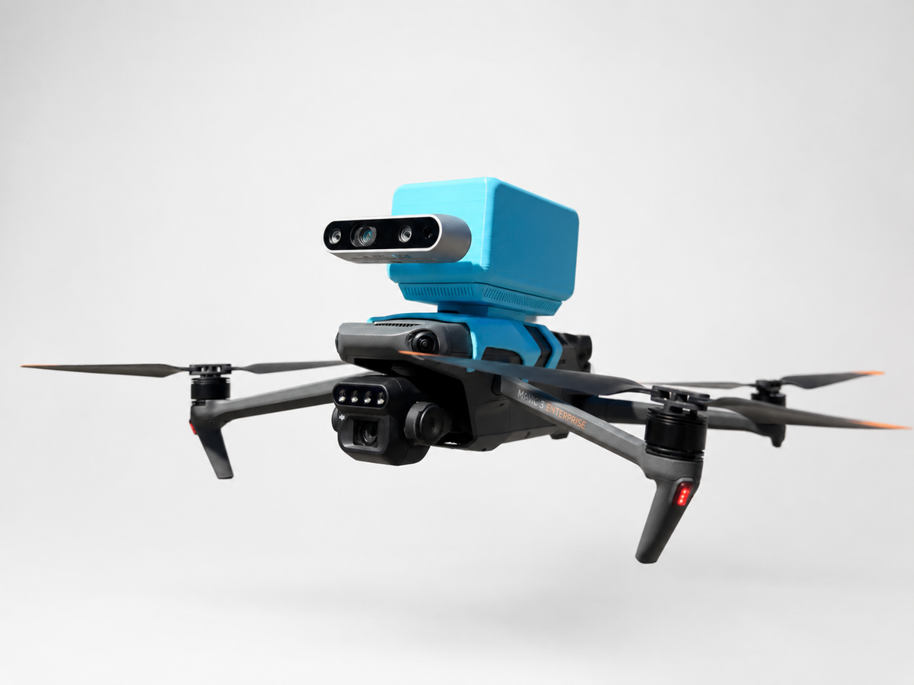

<sub>The payload mounted to a DJI Mavic 3M</sub>

</div>

---

## At a Glance

|  |  |
|:--|:--|
| **Timeline** | January — August 2026 (8 months) |
| **Team** | Atmosense Capstone Team — 5 members |
| **My role** | Hardware & Software Lead |
| **Field trials** | 🇹🇼 National Taiwan University · 🇰🇷 Seoul National University |
| **Recognition** | 🏆 Best Capstone Project — SFU Mechatronic Systems Engineering Demo Day |

---

## 📋 The Problem

CO₂ is the raw material of photosynthesis. In a sealed greenhouse a dense crop can pull ambient
concentration *below* outdoor levels within hours, and supplementing it back into the right band is one
of the most effective yield levers a grower has, often using CO₂ already produced as a combustion byproduct
of heating the facility.

The hard part is knowing **where the CO₂ actually goes**. Concentration varies substantially across a
large growing space, driven by canopy uptake, vent position, injection geometry, and thermal
stratification. Yet most operators supplement blind, from a single sensor or none at all. A fixed
sensor network at the resolution needed would mean hundreds to thousands of nodes; wiring, calibration
drift, and maintenance make that impractical to scale commercially.

**Atmosense replaces the sensor network with one mobile sensor and a model.**

<!-- TODO: cite a yield figure for CO₂ enrichment (e.g. ambient → ~1000 ppm) with a source. A single
     hard number here does a lot of work for a reader skimming the first screen. -->

---

## 🎥 Demo

### Live Mission Control

Full telemetry streams over local Wi-Fi to a Foxglove Desktop ground station. The dashboard visualizes live 3D trajectory with georeferenced samples, tracked camera feed, and live sensor plots. Mission and recording control
sent back to the payload.

<div align="center">

</div>

### Reconstructed CO₂ Field

- Model output over a full day at the NTU greenhouse. 
- **Concentration** (left) is the posterior mean
- **uncertainty** (right) is the posterior standard deviation over the same volume. 

Uncertainty collapses along flown paths and grows in unvisited corners and in the gaps between flights, which is exactly the behaviour a grower needs to see before trusting a number.

<table>
<tr>
<td width="50%" align="center">
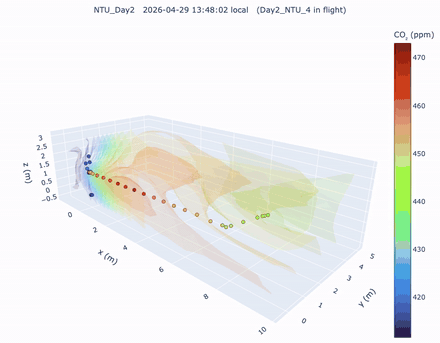
<br><b>Concentration</b> — μ(x,&nbsp;τ)
</td>
<td width="50%" align="center">
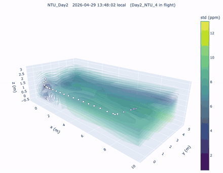
<br><b>Uncertainty</b> — σ(x,&nbsp;τ)
</td>
</tr>
</table>

<div align="center">
<sub>10 m × 5 m × 3 m greenhouse volume · time-lapse across a single day.<br>
Frames marked <i>"no flight active — temporal interpolation"</i> are the model predicting <b>between</b> flights.</sub>
</div>

---

## ⚙️ System Architecture

Everything runs onboard a **Raspberry Pi 5** under **Ubuntu 24.04 LTS** and **ROS 2 Jazzy**. The
complete mission is retained locally as MCAP while a Foxglove Bridge streams live telemetry over Wi-Fi,
so a dropped link costs you the live view, never the data.

<div align="center">
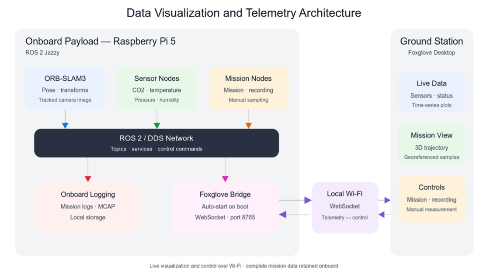
</div>

### ROS 2 Node Graph

<div align="center">
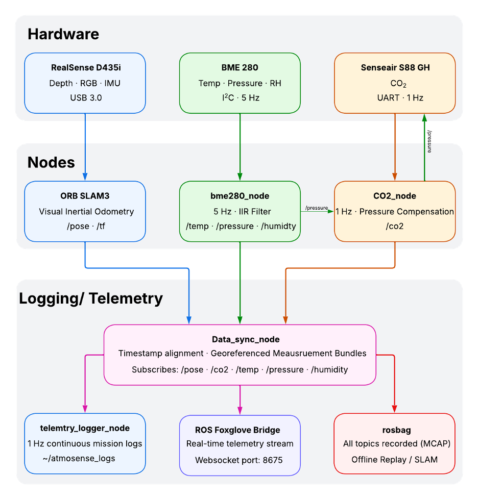
</div>

Three sensor streams run at **different rates** 
- SLAM pose from the D435i at 17–19 Hz
- environmental data at 5 Hz
- CO₂ at 1 Hz 

so the `data_sync_node` handles timestamp alignment using a circular ring buffer and nearest neighbor alignment and emits **georeferenced measurement bundles**. 


- **Pressure compensation.** `bme280_node` publishes `/pressure` straight into `co2_node`, because NDIR
  CO₂ readings shift with ambient pressure. Uncompensated, that error walks into every sample and
  cannot be recovered after the fact.
- **Everything is recorded.** All topics go to rosbag2/MCAP, which means SLAM can be re-run offline
  against the raw stream without another flight, which is the difference between one shot at a field trial and
  as many as you need. Several of the results below come from reprocessing bags recorded in Taipei and Seoul
  after we were back in Vancouver.

---

## How It Works

### 🌀 Rotor Downwash

An airborne gas sensor measures whatever air the rotors put in front of it. Mount an NDIR cell
carelessly and you are sampling the drone's own recirculated wake rather than the greenhouse.

We ran a **CFD analysis of the airframe in SolidWorks** to map the velocity field around the vehicle
and identify low-velocity zones suitable for the intake. The chosen placement was then **validated in
flight against co-located static instrumentation**, confirming the moving sensor tracks a fixed
reference rather than its own downwash.

<!-- TODO: add the CFD velocity-field plot (assets/results/cfd-velocity-field.png) and state the
     validation result numerically — e.g. "agreement within X ppm of a static reference at the same
     location". The claim is much stronger with the number attached. -->

### 📍 No GPS Indoors

Greenhouse structures block GPS, and the interior is hostile to vision as well: repetitive rows of
near-identical plants defeat place recognition, glazing and specular surfaces corrupt stereo depth, and
lighting shifts with cloud cover.

**ORB-SLAM3** runs onboard in stereo visual-inertial mode on the RealSense D435i, publishing `/pose`
and `/tf` so every CO₂ sample is tagged with a 3D coordinate at the moment of acquisition — entirely
independent of the host drone's own state estimate, which is what keeps the payload portable across
airframes.

ORB-SLAM3's **Atlas** multi-map backend matters here specifically: when tracking is lost in a
featureless aisle, the system opens a new submap and merges it back on re-localization, rather than
losing the remainder of the flight.

### 📈 Deep Kernel Learning GP Regression

A flight yields a few hundred georeferenced samples along a one-dimensional path through a
three-dimensional volume. Growers need a continuous field. Closing that gap — sparse, non-uniformly
distributed observations to a full volumetric estimate *with error bars* — is a regression problem
where the uncertainty matters as much as the mean.

I developed a **spatiotemporal Deep Kernel Learning GP** in GPyTorch: neural feature extractors feeding
a Gaussian process kernel, trained end to end.

<div align="center">
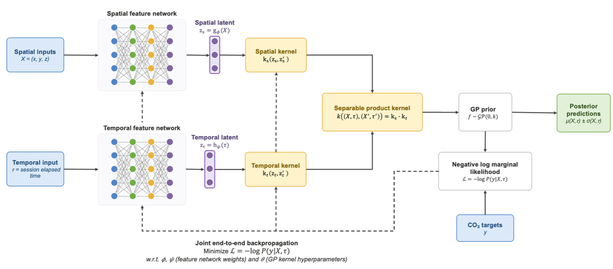
</div>

Space and time each get their **own feature network**, producing two latent embeddings combined through
a **separable product kernel**. The spatial network follows an encoder-style shape — an initial
expansion followed by gradual compression — landing in a latent space of *higher* dimension than the
raw (x, y, z) input, which gives the kernel room to warp distances non-isotropically. Feature-network
weights and GP hyperparameters are learned **jointly**, so the model discovers its own notion of
spatial similarity rather than being handed a fixed distance metric.

Why this over plain interpolation (IDW, kriging):

- **Learned structure.** A stationary RBF assumes CO₂ correlates the same way everywhere. The feature
  networks let the model learn that plumes, aisles, and vertical stratification each behave differently.
- **Time is a real dimension.** The temporal kernel means the model predicts the field *between*
  flights, not just during them.
- **Calibrated uncertainty.** Every prediction carries a σ, which is what makes the map honest about
  where it is guessing.
- **Right-sized for the data.** At a few hundred points per flight, an exact GP performs full Bayesian
  inference at negligible cost. A deeper model would have nothing to learn from — and no principled
  uncertainty to report.

---

## 🔧 Hardware

I designed the sensor PCB as a custom **Hardware-Attached-on-Top (HAT)** in KiCad, carrying the CO₂ and
environmental-compensation sensors and interfacing directly with the Pi's GPIO header. It integrates
with active cooling, a UPS, and battery inside a snap-fit enclosure that ducts air across the sensors
and out the bottom vents, with a fitted bracket fastening the payload to the drone and a stereo camera
mount.

<div align="center">
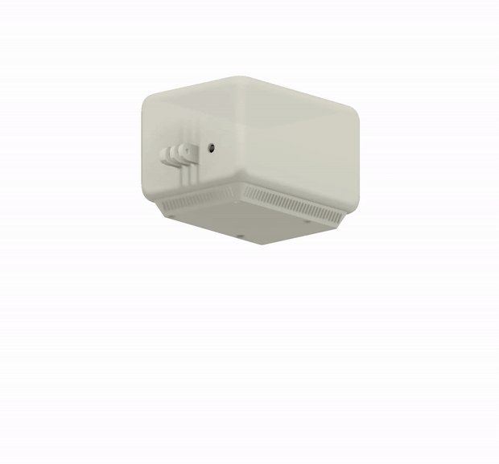
<br><sub><b>Z2 payload — exploded view.</b> Top cover, compute stack (Pi 5 + Z1 Sensor HAT), main shell, vented base tray.</sub>
</div>

<table>
<tr>
<td width="50%">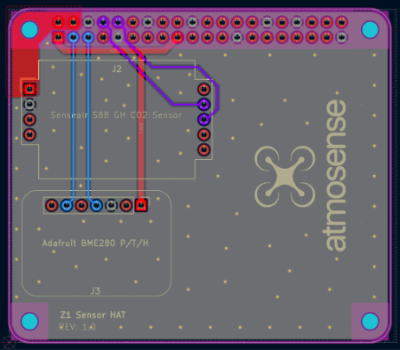<br><sub align="center">Z1 Sensor HAT — KiCad layout</sub></td>
<td width="50%">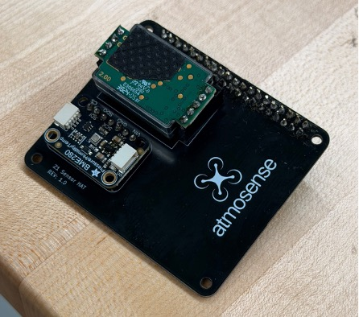<br><sub align="center">Assembled HAT with S88 and BME280 populated</sub></td>
</tr>
</table>

| Component | Part | Interface |
|:--|:--|:--|
| CO₂ sensor | Senseair S88 GH (NDIR) | UART · 1 Hz · pressure-compensated |
| Environmental | Adafruit BME280 — temp / pressure / RH | I²C · 5 Hz · IIR filtered |
| Camera | Intel RealSense D435i — depth · RGB · IMU | USB 3.0 |
| Sensor PCB | Custom Z1 Sensor HAT — KiCad Rev 1.0 | GPIO header |
| Compute | Raspberry Pi 5 + active cooler | ROS 2 Jazzy |
| Power | UPS + battery <!-- capacity --> | — |
| Enclosure | Fusion 360 — Z2, snap-fit, front intake / bottom exhaust | — |
| Test platform | DJI Mavic 3 Enterprise | Bracket mount |
| **Total mass** | **<!-- XXX g -->** | — |

---

## 🌏 International Field Trials

The capstone included a **two-week research trip to Taipei and Seoul**, field-testing the payload at
state-of-the-art smart research greenhouses at **National Taiwan University** and **Seoul National
University**.

Those facilities were the ideal validation environment for two reasons. Their **zone-based fixed sensor
networks gave us independent ground truth** to check our measurements and methodology against —
precisely the comparison a lab bench cannot provide. And they are purpose-built to support smart
agriculture technology such as AMRs, with the clearance and access to fly. Commercial greenhouses are
designed to maximize growing space, which makes early-stage R&D there difficult to arrange.

Alongside testing, we presented our methodology, design, and results across academic settings from
small group sessions up to a **40-student graduate seminar**, and discussed improvements directly with
local faculty and greenhouse operators.

<table>
<tr>
<td width="33%" align="center"><br><sub>In flight — NTU Smart Greenhouse</sub></td>
<td width="33%" align="center">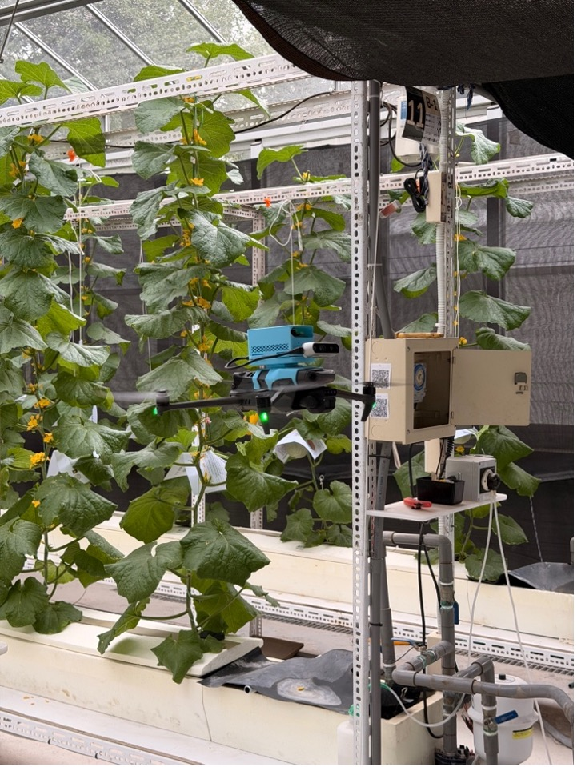<br><sub>Flying a cucumber row — National Taiwan University</sub></td>
<td width="33%" align="center">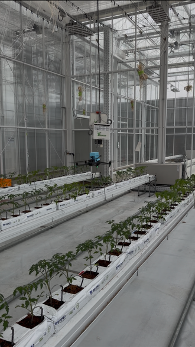<br><sub>Tomato research greenhouse — Seoul National University</sub></td>
</tr>
</table>

---

## 📊 Results

<div align="center">

| Metric | Result |
|:--|:--:|
| Localization accuracy (ATE) | <!-- X.XX m --> |
| CO₂ reconstruction error vs. facility sensors | <!-- XX ppm RMSE --> |
| Coverage per flight | <!-- XX m³ in XX min --> |
| Samples per flight | <!-- ~XXX --> |
| Payload mass | <!-- XXX g --> |

</div>

**What the data showed:**

- **A single sensor cannot see the field.** <!-- Draft, confirm against NTU Day 2 plots before
  publishing: CO₂ spanned roughly 410–475 ppm inside one 10 × 5 × 3 m greenhouse — a ~65 ppm spread
  that no single fixed sensor would resolve. --> This is the core justification for the whole system,
  so it belongs first.
- **Uncertainty behaves as it should.** <!-- Draft: σ ranged ~2–12 ppm, collapsing to the noise floor
  along flown paths and growing in unvisited volume and between flights. --> Verify the range and say
  how fast the collapse is — a reader will want to know how much flight buys how much confidence.
- **Agreement with independent ground truth.** <!-- Compare against the facility zone sensor network.
  State the metric (RMSE? mean absolute error?) and the number of comparison points. -->
- **The spatiotemporal model beats spatial-only interpolation.** <!-- If you have the LOFO holdout
  numbers vs. IDW / kriging, one line with the headline delta is the single most persuasive result on
  this page. -->

<!-- TODO: a static figure here — predicted vs. measured scatter, or a residual histogram — would
     support these bullets better than the animated GIFs alone, which are hard to read quantitatively. -->

---

## 📂 Repository Layout

<!-- TODO: fill this in to match the actual tree. Anyone landing here from a résumé link will want to
     know where the code lives before they start clicking. -->

```
atmosense/
├── ros2_ws/src/         # ROS 2 packages — sensor drivers, sync, SLAM bringup, telemetry
├── ml/                  # Spatiotemporal DKL-GP: models, training, evaluation
├── hardware/            # KiCad project — Z1 Sensor HAT
├── mechanical/          # Fusion 360 enclosure, mount, CFD study
├── notebooks/           # Analysis and figure generation
├── assets/              # Diagrams, demo media, results figures
└── docs/                # Final report, poster, slides
```

### Running It

<!-- TODO: minimal reproduction steps. Even three lines beats nothing:
     1. Flash / provision the Pi
     2. Build the ROS 2 workspace
     3. Launch the payload; connect Foxglove to ws://<pi>:8765
     If a sample MCAP bag can be published, link it — it lets someone run the ML pipeline end-to-end
     without any hardware, which massively widens who can engage with this repo. -->

---

## 🛠️ Tools & Skills I used

<table>
<tr><td width="22%"><b>Robotics</b></td><td>ROS 2 Jazzy · ORB-SLAM3 · stereo visual-inertial SLAM · TF2 · multi-rate sensor synchronization · rosbag2 / MCAP</td></tr>
<tr><td><b>Languages</b></td><td>C++ (real-time perception) · Python (estimation, analysis, tooling)</td></tr>
<tr><td><b>ML / Estimation</b></td><td>PyTorch · GPyTorch · Deep Kernel Learning · spatiotemporal GP regression · uncertainty quantification</td></tr>
<tr><td><b>Hardware</b></td><td>KiCad custom Pi HAT design · I²C / UART sensor integration · sensor compensation · power &amp; thermal design</td></tr>
<tr><td><b>Visualization</b></td><td>Foxglove Studio · Foxglove Bridge · WebSocket telemetry · custom dashboard layouts</td></tr>
</table>

**What this project demanded:** deploying a SLAM stack in a genuinely hostile environment rather than on
a benchmark dataset; choosing probabilistic modeling for a problem where *knowing what you don't know*
is the point; designing a self-contained module under hard mass, power, and vibration budgets; and
validating against independent ground truth at international research facilities — on an accelerated
timeline set by a fixed travel date.

---

## ⚠️ Limitations

Honest scoping of what this system does and does not yet do:

- **Flight paths are pilot-flown.** Coverage quality depends on the operator, and the uncertainty field
  informs the *next* flight rather than steering the current one.
- **Ground truth is coarse.** Facility zone sensors validate at their own locations; the reconstruction
  between them is checked by held-out flight data, not by independent measurement.
- **Single gas, single facility type.** Results come from research greenhouses; commercial layouts are
  taller, denser, and more cluttered.
- <!-- TODO: add flight-endurance limit with payload mass attached, and any SLAM failure modes you
     actually hit in the field. Naming your own failure modes reads as confidence, not weakness. -->

---

## 🔭 Future Work

- **Closed-loop adaptive sampling** — the uncertainty field currently guides a pilot; on a drone
  exposing an autonomy API it could drive waypoints directly, flying where the model is least certain.
- **Multi-gas payload** — extend the same localization-and-GP pipeline to other gases and VOCs.
- **Lighter module** — reduced mass widens the set of drones that can carry it and extends endurance.
- **Grower-facing integration** — feed field estimates into a facility's CO₂ injection controller.
- **Custom airframe** — the payload currently duplicates sensing the drone's internal flight controller
  already performs; a purpose-built development drone would allow tighter integration and smarter
  deployments.

---

## 👥 Team & Docs

**Atmosense Capstone Team** — 5 members · SFU Mechatronic Systems Engineering · Advisor: <!-- Prof. Name -->

📘 [Final Report](docs/) · 🖼️ [Demo Day Poster](docs/) · 🎬 [Full Demo Video](<!-- URL -->) · 📊 [Slides](docs/)

---

<div align="center">
<sub>Undergraduate engineering capstone · January — August 2026<br>
Questions about the technical approach? Open an issue.</sub>
</div>
